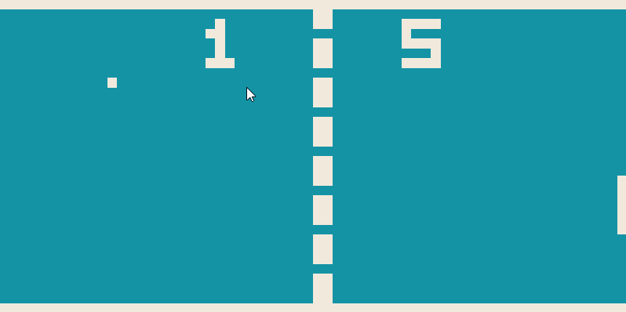

# Chip8

A Chip8 emulator written for educational purpose using the [Beef language](https://www.beeflang.org/).



## Keymap
```
 CHIP-8         Emulator
|1|2|3|C|  =>  |1|2|3|4|
|4|5|6|D|  =>  |Q|W|E|R|
|7|8|9|E|  =>  |A|S|D|F|
|A|0|B|F|  =>  |Z|X|C|V|
```

## Resources

* http://devernay.free.fr/hacks/chip8/C8TECH10.HTM
* http://mir3z.github.io/chip8-emu/
